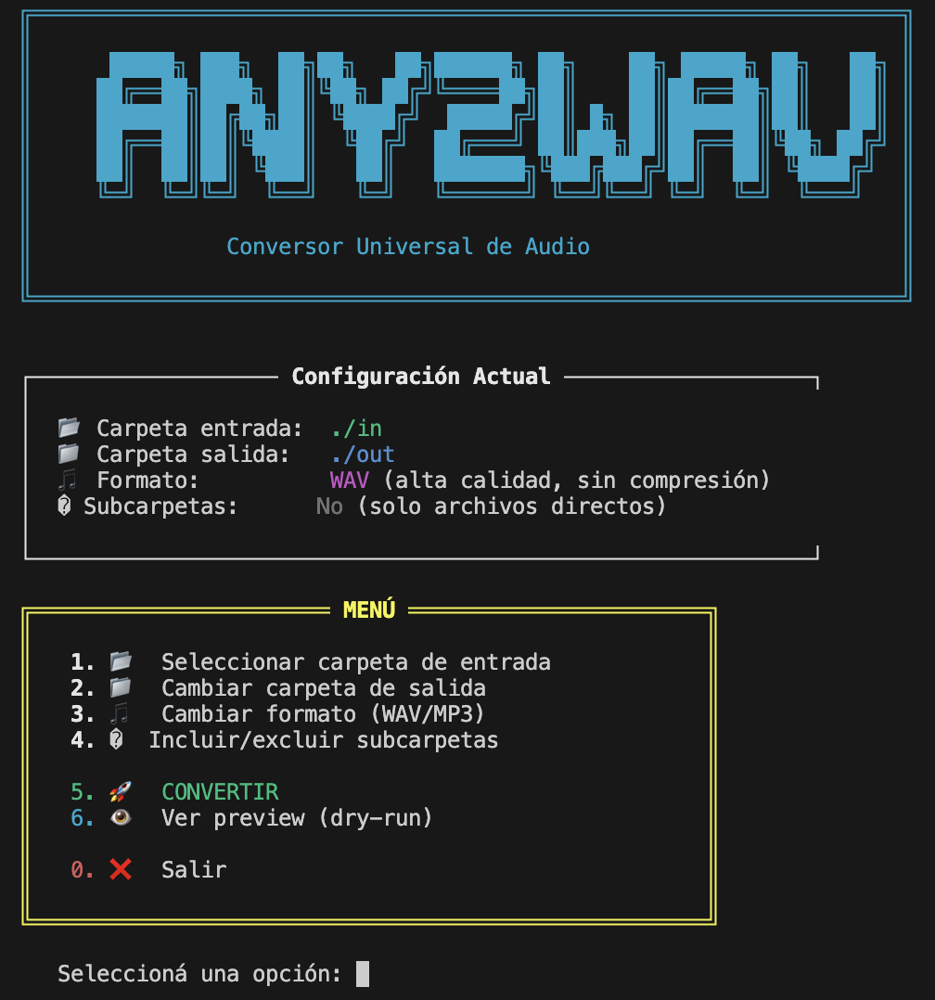

```
╔═══════════════════════════════════════════════════════════════════╗
║                                                                   ║
║      █████╗ ███╗  ██╗██╗   ██╗██████╗ ██╗    ██╗ █████╗ ██╗   ██╗ ║
║     ██╔══██╗████╗ ██║╚██╗ ██╔╝╚════██╗██║    ██║██╔══██╗██║   ██║ ║
║     ███████║██╔██╗██║ ╚████╔╝  █████╔╝██║ █╗ ██║███████║██║   ██║ ║
║     ██╔══██║██║╚████║  ╚██╔╝  ██╔═══╝ ██║███╗██║██╔══██║╚██╗ ██╔╝ ║
║     ██║  ██║██║ ╚███║   ██║   ███████╗╚███╔███╔╝██║  ██║ ╚████╔╝  ║
║     ╚═╝  ╚═╝╚═╝  ╚══╝   ╚═╝   ╚══════╝ ╚══╝╚══╝ ╚═╝  ╚═╝  ╚═══╝   ║
║                                                                   ║
║               Conversor Universal de Audio                        ║
║                                                                   ║
╚═══════════════════════════════════════════════════════════════════╝
```

> Extrae audio de cualquier archivo multimedia y conviértelo a WAV o MP3

[](https://python.org)
[](LICENSE)
[](https://ffmpeg.org)



---

## ✨ Características

| Feature | Descripción |
|---------|-------------|
| 🎵 **Multi-formato entrada** | MP3, MP4, M4A, MKV, AVI, FLAC, OGG, WEBM, y más |
| 🔊 **Formatos salida** | WAV, MP3 |
| ⏩ **Skip inteligente** | No reprocesa archivos que ya existen |
| 📊 **Progreso visual** | Barras de progreso, contadores, estadísticas |
| 📝 **Logging completo** | Registro de ejecución y conversiones en JSON |
| 🖥️ **Menú interactivo** | Interfaz ASCII visual con `./run.sh` |

---

## 📋 Requisitos

- **Python 3.8+**
- **FFmpeg** instalado en el sistema

### Instalar FFmpeg

```bash
# macOS
brew install ffmpeg

# Ubuntu/Debian
sudo apt install ffmpeg

# Windows - Descargar de https://ffmpeg.org/download.html
```

---

## 🚀 Instalación

```bash
# Clonar el repositorio
git clone https://github.com/vlasvlasvlas/any2wav.git
cd any2wav

# Ejecutar setup (crea venv e instala dependencias)
chmod +x setup.sh
./setup.sh
```

---

## 📁 Carpetas de Trabajo

Por defecto, any2wav usa estas carpetas:

```
any2wav/
├── in/     ← Poné acá tus archivos a convertir
└── out/    ← Acá aparecen los archivos convertidos
    ├── wav/
    └── mp3/
```

**Simplemente:**
1. Copiá tus archivos a `./in`
2. Ejecutá `./run.sh`
3. Encontralos convertidos en `./out/wav` o `./out/mp3`

---

## 📖 Uso

### Opción 1: Menú Interactivo (recomendado)

```bash
./run.sh
```

Abre un menú visual donde podés:
- Ver/cambiar carpeta de entrada y salida
- Elegir formato de salida (WAV/MP3)
- Incluir subcarpetas en la búsqueda
- Ver preview antes de convertir

### Opción 2: Línea de Comandos

```bash
# Activar entorno virtual
source venv/bin/activate

# Convertir todos los archivos a WAV
any2wav ./in -f wav

# Convertir a MP3
any2wav ./in -f mp3

# Especificar otra carpeta
any2wav ./mi_carpeta -o ./otra_salida -f wav

# Incluir subcarpetas
any2wav ./in -f wav -r

# Ver qué haría sin ejecutar (dry-run)
any2wav ./in --dry-run

# Ver ayuda
any2wav --help
```

---

## 📊 Display Visual

```
╔═══════════════════════════════════════════════════════════════════╗
║               any2wav - Conversor Universal de Audio              ║
╚═══════════════════════════════════════════════════════════════════╝

ℹ️  Buscando archivos multimedia en in...

┌─────────────────────┬───────────────────┐
│ Configuración       │ Valor             │
├─────────────────────┼───────────────────┤
│ 📂 Carpeta entrada  │ in                │
│ 📁 Carpeta salida   │ out/wav           │
│ 🎵 Formato salida   │ WAV               │
│ 📊 Archivos         │ 5                 │
└─────────────────────┴───────────────────┘

Convirtiendo a WAV... ━━━━━━━━━━ 100% 0:00:12

✅ cancion.mp3 → wav (12.5 MB, 3:45)
✅ video.mp4 → wav (8.2 MB, 2:30)
⏩ audio.wav → ya existe, saltando

✅ ¡Conversión completada!
```

---

## 📝 Logs

Los logs se guardan en la carpeta de salida:

- **`any2wav.log`** - Log de ejecución
- **`conversions.json`** - Registro de conversiones

---

## 🗂️ Estructura del Proyecto

```
any2wav/
├── any2wav/           # Módulos Python
│   ├── cli.py         # CLI con Rich UI
│   ├── converter.py   # FFmpeg wrapper
│   ├── detector.py    # FFprobe wrapper
│   └── logger.py      # Sistema de logging
├── in/                # Archivos a convertir
├── out/               # Archivos convertidos
├── run.sh             # Menú interactivo
├── setup.sh           # Setup automático
└── README.md
```

---

## 📄 Licencia

MIT

---

**💡 Tip:** Este proyecto nació de la necesidad de convertir archivos para subir a Bandcamp, que requiere formato WAV.
